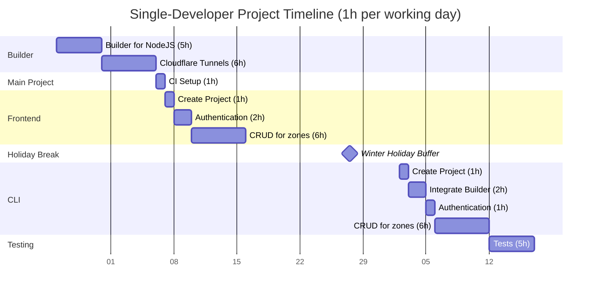

# chyve-ct

```mermaid
gantt
    title Single-Developer Project Timeline (1h per working day)
    dateFormat  YYYY-MM-DD
    axisFormat %d
    
    section Builder
    Builder for NodeJS (5h)           :b1, 2024-11-25, 5d
    Cloudflare Tunnels (6h)          :b2, after b1, 6d
    
    section Main Project
    CI Setup (1h)                     :c1, after b2, 1d
    
    section Frontend
    Create Project (1h)               :f1, after c1, 1d
    Authentication (2h)               :f2, after f1, 2d
    CRUD for zones (6h)              :f3, after f2, 6d
    
    section Holiday Break
    Winter Holiday Buffer            :milestone, 2024-12-23, 2025-01-01
    
    section CLI
    Create Project (1h)               :cli1, 2025-01-02, 1d
    Integrate Builder (2h)            :cli2, after cli1, 2d
    Authentication (1h)               :cli3, after cli2, 1d
    CRUD for zones (6h)              :cli4, after cli3, 6d
    
    section Testing
    Tests (5h)                        :t1, after cli4, 5d
```
